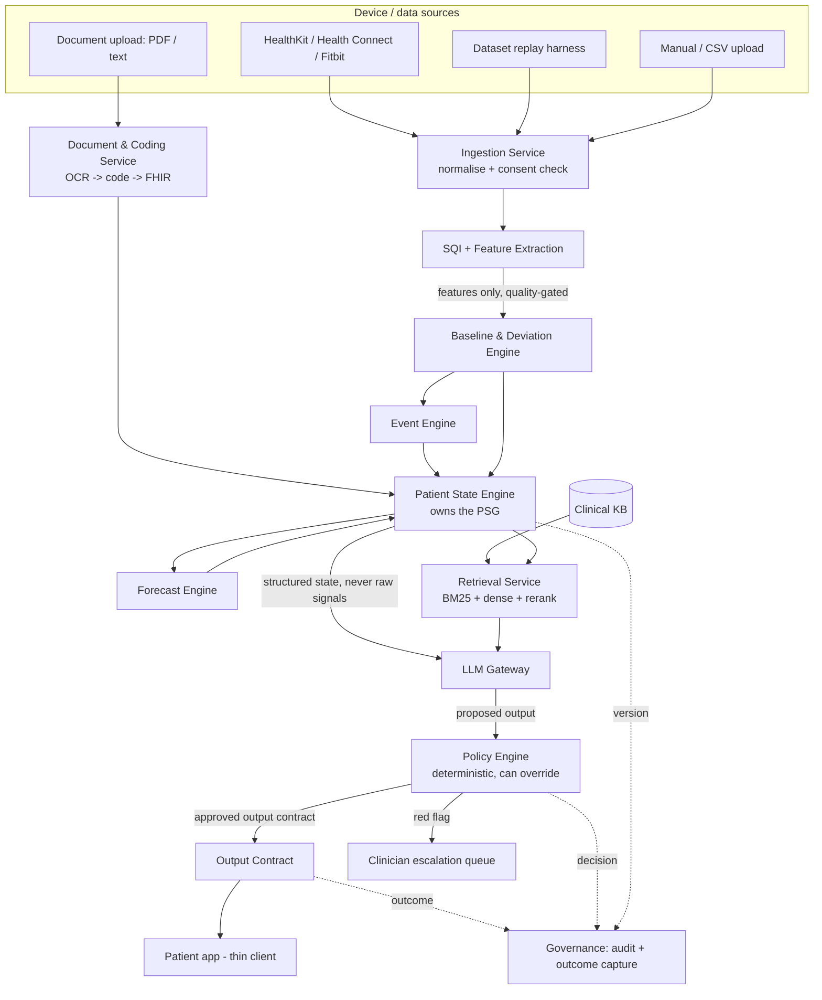
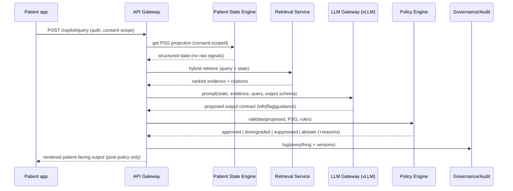

# 02 — Architecture Specification

## 1. Principles (freeze)

1. Deterministic Patient State Engine is the primary intelligence; the LLM is explanation/orchestration only.
2. The LLM never consumes raw physiological signals — only structured features and PSG state.
3. The Patient State Graph (PSG) is the single source of truth; nothing bypasses it.
4. The deterministic Policy Engine is the last gate before any user-facing output and can override the LLM.
5. No closed-loop self-modification: the LLM never edits rulesets, schemas, or routing.

## 2. Module boundaries

| Module | Responsibility | May NOT do |
|---|---|---|
| Ingestion Service | Adapter normalisation → per-reading schema; consent check | Compute baselines; call the LLM |
| SQI / Feature Extraction | Signal quality scoring + classical physiological features | Persist to PSG directly |
| Baseline & Deviation Engine | Per-user baselines; deviation scoring | Make clinical decisions; emit user text |
| Event Engine | Combine deviations → candidate events with severity | Escalate to a user directly (goes through Policy) |
| Patient State Engine (owns PSG) | Validate + commit state; versioning; source of truth | Generate explanations |
| Forecast Engine | Short-horizon forecasts on baselines | Predict disease; bypass Policy |
| Document/Coding Service | OCR → coding (LOINC/SNOMED/RxNorm) → FHIR | Decide clinical meaning |
| Retrieval Service | Hybrid search + rerank over KB + patient record | Generate answers |
| LLM Gateway | Single choke point for all model calls; local vLLM ↔ OpenRouter behind one interface | Persist clinical state; bypass Policy |
| Policy Engine | Deterministic validation/override of all outputs | Be implemented inside the LLM |
| Governance Service | Consent, RBAC, audit, model/ruleset version registry | — |
| API Gateway | AuthN/Z, routing, rate limiting | Hold business logic |

**Hard rule:** raw signals flow Ingestion → SQI/Features and are reduced to features there. Only features and structured state cross into the Patient State Engine and beyond. The LLM Gateway is physically downstream of the PSG and can only be handed structured context.

## 3. End-to-end data flow



## 4. The Patient State Graph (PSG) — definition

The PSG was previously undefined; this section is the fix. It is a **per-user, versioned, append-only typed graph** that is the source of truth for the patient's physiological and clinical state. It is **realised over PostgreSQL** (no graph DB in v1): nodes and edges are versioned relational tables exposed through a typed graph API. The LLM reads a *projection* of the PSG; it never writes to it.

### 4.1 Node types

| Node | Key fields |
|---|---|
| `Patient` | uuid7, age/dob, sex_at_birth, height, weight(+date), blood_group, disability? |
| `Metric` | metric_code, context, current_baseline_ref, latest_value, latest_ts, unit |
| `Baseline` | metric_code, context, center, dispersion, method, sample_n, window, confidence, computed_at, version |
| `Reading` | value, ts_tz, device, sqi, context, unit, included_in_baseline(bool) |
| `Deviation` | metric_code, magnitude, direction, z_robust, confidence, baseline_ref, ts |
| `Event` | type, severity, contributing_deviations[], onset_ts, status |
| `Condition` | snomed_code, status, onset, source_doc_ref |
| `Medication` | rxnorm_code, dose?, status, source_doc_ref |
| `Allergy` | substance_code, reaction, severity, source |
| `Observation` | loinc_code, value, unit, ts, source_doc_ref (from documents/labs) |
| `Document` | type (SOP/clinical-note/discharge/medical-text), uri, ocr_ref, codes[] |
| `Forecast` | metric_code, horizon, point[], interval[], method, generated_at |

### 4.2 Edge types

`has_reading`, `has_baseline`, `deviates_from` (Reading→Baseline), `aggregates` (Event→Deviation), `indicates` (Event→Condition, advisory), `contraindicates` (Medication↔Allergy/Condition), `derived_from` (Observation→Document), `forecasts` (Forecast→Metric), `supersedes` (versioning on any node).

### 4.3 Versioning & audit

Every node is immutable once written; updates create a new version linked by `supersedes`. The "current" view is a query over latest non-superseded versions. This gives free auditability and lets the outer loop reconstruct exactly what state produced any output.

### 4.4 What the LLM sees

A **PSG projection**: a compact, typed JSON snapshot (current baselines, recent deviations, active conditions/meds/allergies, relevant observations, latest forecast) — assembled by the Patient State Engine, scoped by consent, and stripped of raw signal arrays. See `04 §5`.

## 5. Copilot request sequence



## 6. Stable interfaces (so deferred parts swap cleanly)

```text
BaselineEngine:
  update(reading: Reading) -> None
  score(reading: Reading) -> DeviationResult
  get_baseline(metric, context) -> Baseline
# v1 impl: StatisticalBaselineEngine. DEFERRED impl: FoundationEncoderBaselineEngine.

FeatureExtractor:
  extract(window: SignalWindow) -> FeatureSet
# v1 impl: ClassicalFeatureExtractor (+SQI). DEFERRED: biosignal foundation encoder (PaPaGei-S/Pulse-PPG).

LLMGateway:
  complete(messages, schema, model_profile) -> StructuredOutput
# routes to local vLLM or OpenRouter by profile; identical call site.

Retriever:
  search(query, scope) -> list[EvidenceChunk]
```

Each deferred swap is a new implementation of an existing interface — no call-site changes, no schema changes.

## 7. Deployment topology

- Host machine: GPU + vLLM serving the primary model (`‹GPU-DEP›`).
- Docker network: all stateless services + Postgres + Qdrant. The LLM Gateway reaches vLLM via the host endpoint (default) or an in-Compose vLLM container (optional profile). See `08`.
- Trust boundary = the host/VPC. OpenRouter sits outside it and is reachable only from the LLM Gateway in `dev`/de-identified profiles.
